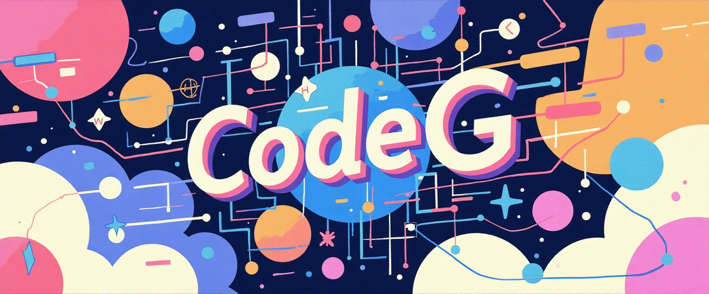

  

<h1>Hi there 👋</h1>

I’m <b>Code G (Greivin)</b>, a developer focused on building <b>clear, maintainable, and useful</b> solutions. I’m known for <b>responsibility</b>, <b>direct communication</b>, and a <b>high quality bar</b> in every delivery. I like to understand the problem before writing code, prioritize <b>simplicity</b>, <b>performance</b>, and <b>best practices</b>, and enjoy collaborating in teams where <b>candid feedback</b> and <b>continuous learning</b> are part of everyday work.

<ul>
  <li>✅ <b>Professional:</b> I honor commitments, document what matters, and sweat the details.</li>
  <li>🧠 <b>Curious:</b> I learn quickly and adapt to new contexts and domains.</li>
  <li>🤝 <b>Collaborative:</b> I value teamwork and continuous improvement.</li>
  <li>🔍 <b>Results-oriented:</b> Technical decisions aligned with product impact.</li>
</ul>

---

## 🌐 Socials

  
  
  

---

## 💻 Tech Stack

  

